# YOLOv8 Object Detection on Pascal VOC 2017
This project showcases the complete training pipeline, evaluation, and comparative model analysis using the YOLOv8 framework on the Pascal VOC 2007 and 2012 datasets.

---

## 🧠 Objective

The primary goal was to implement object detection using YOLOv8 on the Pascal VOC dataset, fine-tune various models, and iteratively improve performance through analysis and visualization.

---

## 📦 Dataset

**Source:** Pascal VOC 2007 + Pascal VOC 2012

* Merged and preprocessed using a custom XML-to-YOLO converter
* Resulting structure:

```
VOC_YOLO/
├── images/
│   ├── train/
│   └── val/
├── labels/
│   ├── train/
│   └── val/
├── voc.yaml
```
📊 Dataset label statistics:

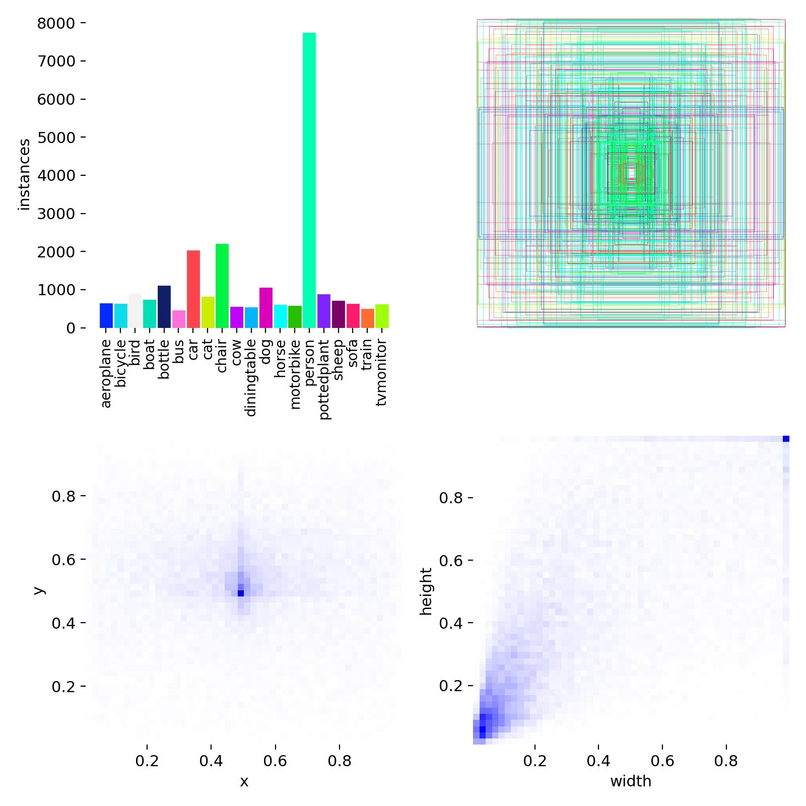---

## 🧠 Model Overview

| Model        | Status       | Epochs  | Notes                                |
| ------------ | ------------ |---------| ------------------------------------ |
| `yolov8n.pt` | Trained      | 50      | Lightweight model for baseline       |
| `best.pt`    | Fine-tuned   | 58 (80) | Resume from best weights (train1-10) |
| `yolov8l.pt` | Experimental | 22 (60) | Larger model with better capacity    |

* Optimizer: AdamW
* Learning rate: `lr0=0.003`
* Batch size: 16 or 8

---

## ⚙️ Training Code

```python
from ultralytics import YOLO

model = YOLO("yolov8n.pt")
model.train(
    data="VOC_YOLO/voc.yaml",
    epochs=50,
    imgsz=640,
    batch=16,
    device=0
)
```

Resuming training with a better model:

```python
model = YOLO("train10/weights/last.pt")
model.train(
    resume=True,
    epochs=60,
    patience=10,
    device=0
)
```

---

## 🎯 Results Summary

📊 **Best model found in `train10` folder based on mAP\@0.5:0.95**

| Run     | Precision | Recall | mAP\@0.5 | mAP\@0.5:0.95 |
| ------- | --------- | ------ | -------- | ------------- |
| train1  | 79.67%    | 66.87% | 74.52%   | 54.23%        |
| train2  | 78.19%    | 64.15% | 72.20%   | 51.94%        |
| train10 | 78.30%    | 66.30% | 74.30%   | 55.15% ✅      |

📈 **Visual analysis showed smooth convergence without overfitting.**

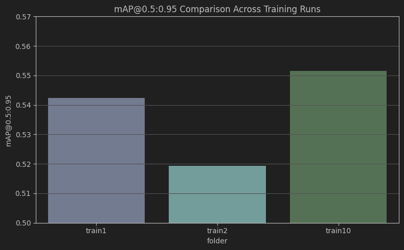

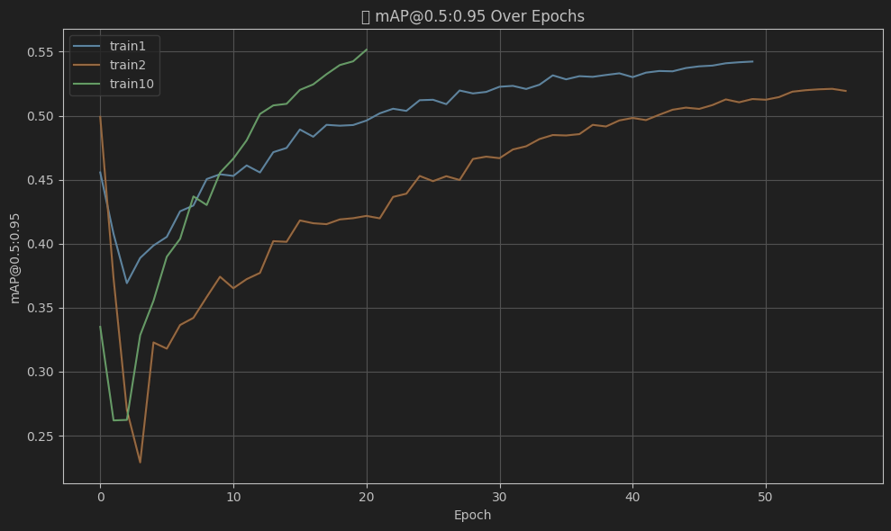

---

## 📊 Evaluation & Visualizations

```python
model = YOLO("train10/weights/best.pt")
metrics = model.val(save=True, save_json=True)
```

Saved visual outputs in `val10/`:

* Confusion matrix (normalized & absolute)
* PR curve, F1-curve, Recall/Precision-Confidence curves
* Batch prediction visualization

📌 Train1 results:

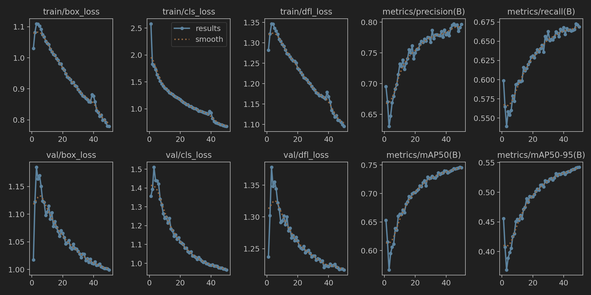

📌 Train10results:

Example Predictions:

  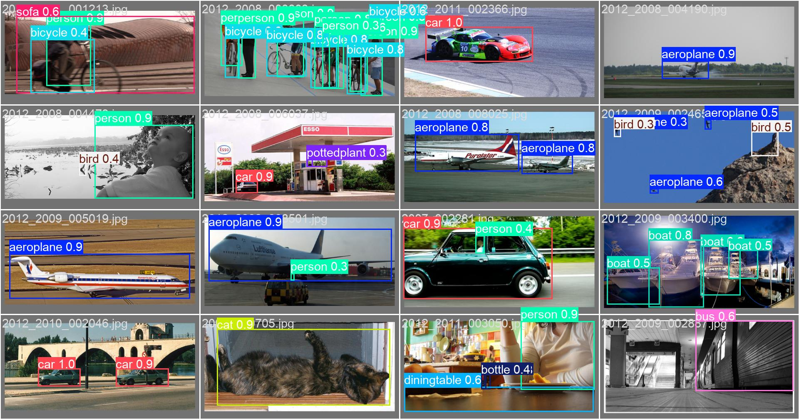
  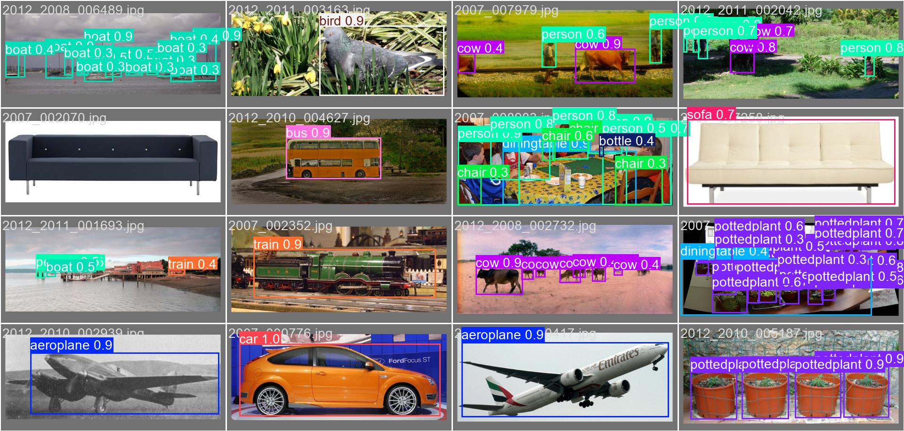

📌 Curve Analysis:

F1-Confidence:

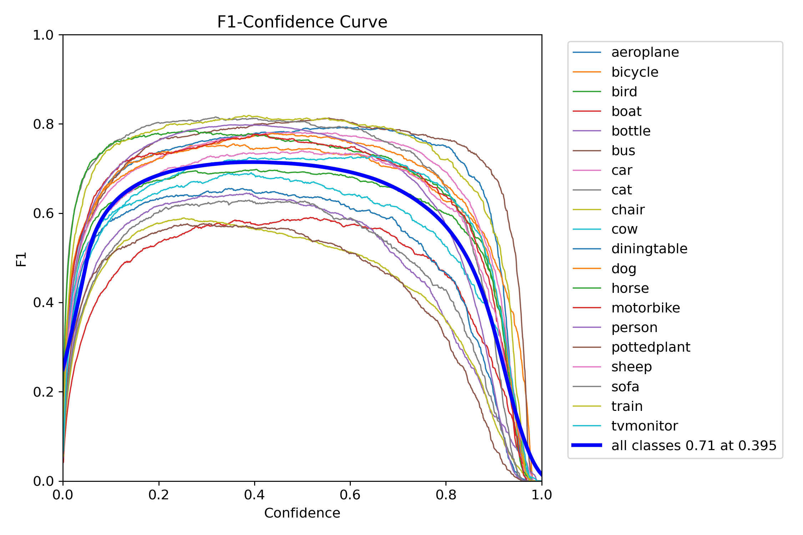

Precision-Confidence:

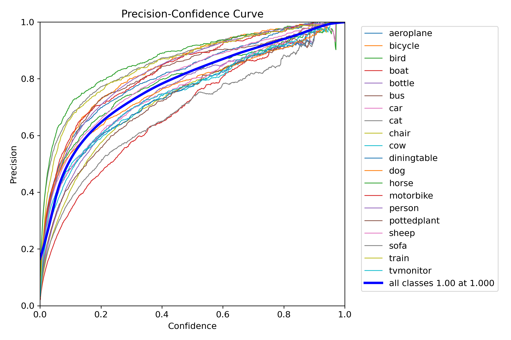

Recall-Confidence:

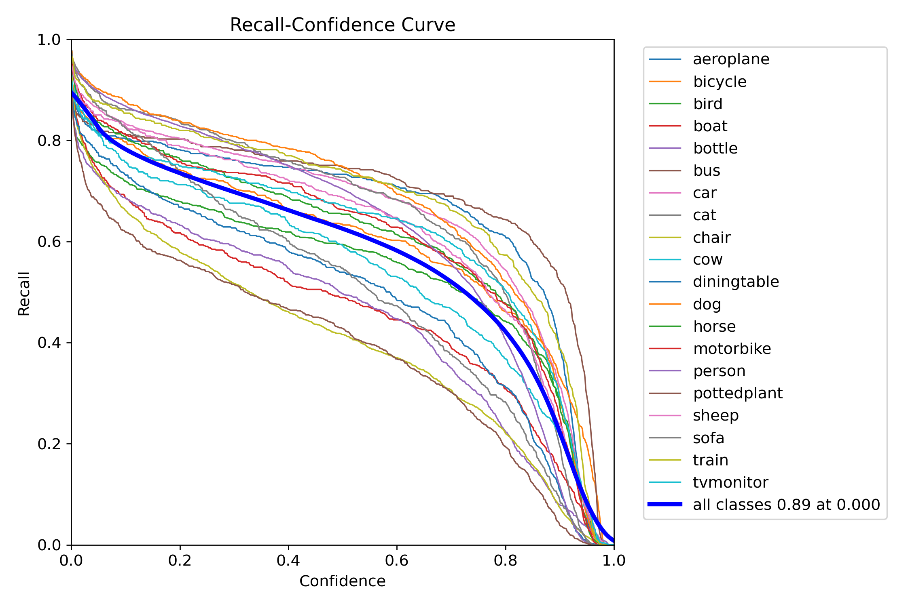

Precision-Recall:

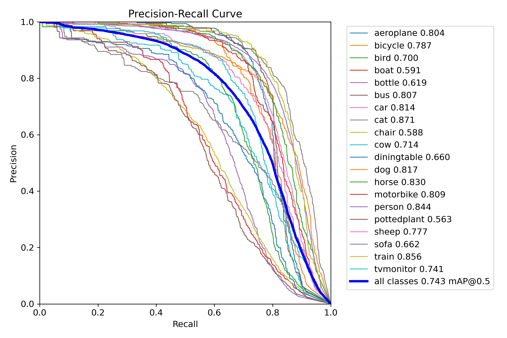

📌 Confusion Matrix:

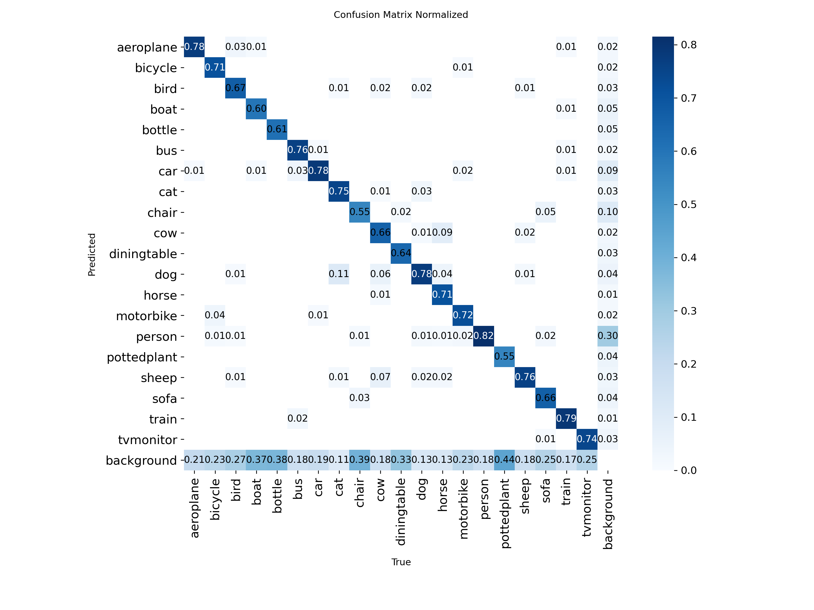


---
## 🔍 **Webcam-based Inference with YOLOv8**

This part of the project implements real-time object detection using a webcam with YOLOv8. The model processes each frame, detects objects, and overlays bounding boxes with the corresponding class labels. In this case, the model effectively identified various objects, including chairs, birds, people, and bottles.

**Key Features**:
- Real-time object detection with YOLOv8
- Bounding boxes and class labels displayed on detected objects
- Efficient processing for real-time performance


### 📝 Model Performance

During real-time detection, the model was able to correctly detect objects such as chairs, bird, people, and bottles with a significant level of accuracy. The bounding boxes were drawn around these objects with correct class labels, proving that the model has learned to detect these categories effectively.

### 🔴 Visual Results
The detection results displayed on the webcam stream were as follows:

- Chairs: Detected with high precision.

- Birds: Correctly identified even in complex background scenarios.

- People: Detected with great accuracy in varying positions.

- Bottles: Properly identified despite size variations.

This showcases the capability of YOLOv8 in real-time object detection with minimal latency.

---

## 🔍 Insights

* Models trained with `yolov8n.pt` achieved reasonable baseline performance
* Fine-tuning improved results by \~1% mAP\@0.5:0.95
* `yolov8l.pt` training showed slower but promising improvements
* Adding epochs improves generalization and performance (expected gain \~2–4% with +100 epochs)

**Analysis**: Given the current training infrastructure (YOLOv8n and YOLOv8l backbones), the achieved results are highly satisfying. Especially, the best model trained under `train10` demonstrated robust performance across all core metrics. The gradual increase in mAP\@0.5:0.95 confirms that the model is not overfitting and would likely benefit from further training. Continued fine-tuning of the `yolov8l.pt` variant is expected to improve detection accuracy significantly, making this pipeline scalable and well-suited for real-world tasks.

---

## 🔁 Future Work

* Train `yolov8l.pt` to 100+ epochs
* Explore `yolov8x.pt` for accuracy maximization
* Apply augmentation strategies and tune anchor boxes
* Add early stopping metrics for training efficiency

---

## ✅ Final Thoughts

This project demonstrated effective use of YOLOv8 for object detection on Pascal VOC. Careful preparation, training, and model analysis allowed for performance evaluation and improvement.

> The process included: dataset preprocessing, format conversion, model training/resuming, metric comparison across folders, and final visualization.

> The model is currently achieving solid metrics, and based on the trends observed, extending training time and leveraging larger architectures will likely yield even better results.

---

## 🧾 Author Notes

| Component       | Specification                                |
| --------------- | -------------------------------------------- |
| **Processor**   | 12th Gen Intel(R) Core(TM) i7-12650H 2.30GHz |
| **RAM**         | 16 GB (15.6 GB usable)                       |
| **GPU**         | NVIDIA GeForce RTX 3060 Laptop GPU (6 GB)    |
| **Storage**     | 477 GB total / 324 GB used                   |

All training and testing were executed locally with CUDA acceleration. Results were generated over the course of multiple sessions using GPU memory efficiently without overheating risks.

